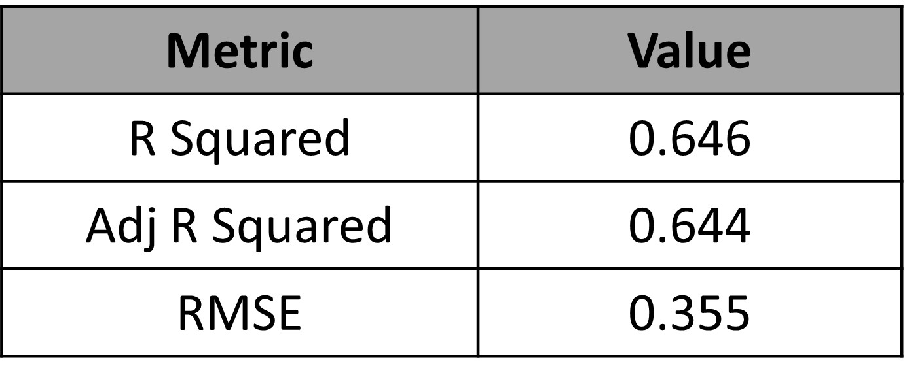
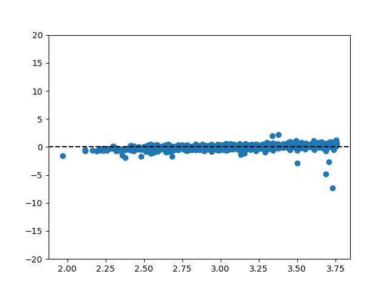
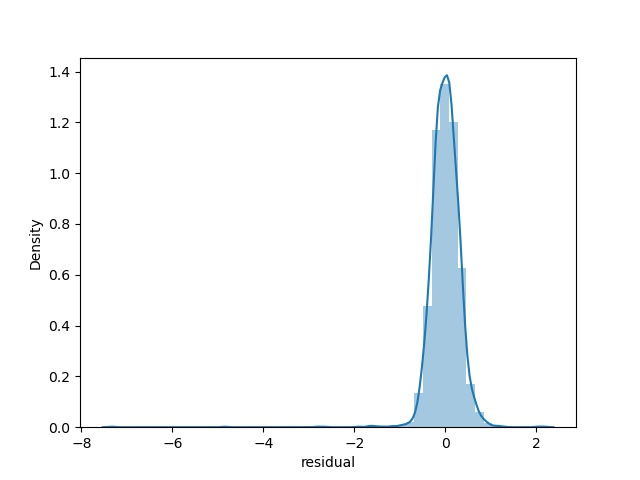

# NYC-AirBNB-Open-Data-Analysis

<b>About Dataset</b>

Context:  
Since 2008, guests and hosts have used Airbnb to expand on traveling possibilities and present more unique, personalized way of experiencing the world. This dataset describes the listing activity and metrics in NYC, NY for 2019.

Content:  
This data file includes all needed information to find out more about hosts, geographical availability, necessary metrics to make predictions and draw conclusions.

Acknowledgements:  
This public dataset is part of Airbnb, and the original source can be found on this website.

Inspiration:  
What can we learn about different hosts and areas?
What can we learn from predictions? (ex: locations, prices, reviews, etc)
Which hosts are the busiest and why?
Is there any noticeable difference of traffic among different areas and what could be the reason for it?

<b>Exploratory Data Analysis</b>

Observations:

- Unique number of neighborhoods : 5
- Unique number of room types : 3
- There are 48895 different airbnbs listed in the dataset.
- There are 37457 different airbnb owners in the dataset.

<b>Airbnb's per user</b>

 

 

Observations:

- ~86% of the owners have only 1 airbnb.
- ~9% of the owners have 2 airbnb's.
- ~2.5% of the owners have 3 airbnb's.

<b>Distribution of Airbnb's based on the neighborhood</b>

 

 

Observations:

- ~44% of the Airbnb's are located in Manhattan.
- ~41% of the Airbnb's are located in Brooklyn.
- ~15% of the Airbnb's are located in Bronx, Queens and Staten Island.

<b>Distribution of Airbnb's based on the type of room</b>

 

 

Observations:

- ~52% of the Airbnb's are are Entire apartment.
- ~45% of the Airbnb's are Private room.
- ~2% of the Airbnb's are shared rooms.

<b>Distribution of Airbnb's based on the price</b>

Observations:

- The mean price of Airbnb's are around $100.
- The price of most of the AirBNB's are concentrated around the $100. 
- A versy small percentage of AirBNB's have higher price than $300.

<b>Distribution of Airbnb's based on the price in different neighborhoods</b>

Observations:

- The mean price of Airbnb's in Manhattan is the highest.

- The mean price of Airbnb's are slightly lower in Brooklyn than Manhattan and the most of them are concentrated around the mean.

<b>Region and Airbnb's</b>

<b>Regionwise Room type</b>

<b>Availability of rooms</b>

<b>Scatterplot of features</b>

Observation:

- There was no significant correlation between any feature in the dataset.

<b>Regression Analysis</b>

To build a regression model for predicting the price of AirBNB, we have filtered only those BNB's which are below $200 dollar each night. The filtering was performed as most of the BNB's are lower than $200 (It can be seen in the PDF above).
 

Before builing the model, irrelavant features were removed such as - 

 - Primary keys (irrelavant) - Id, Host_id

 - Categorical variables (irrelevant) - neighbourhood_group, room_type
   (We have label encoded these groups)

 - Removing one category type from each categories - Staten Island, Shared Room
   (As these are additional group in the predictors)

 

To build the model, stepwise regression modelning was performed.

<b>1st model</b>

Predictors:

- Entire home/apt
- Manhattan
- latitude
- longitude 
- number_of_reviews 
- calculated_host_listings_count

Results:

- price

OLS Summary:

<table>
	<tr><td>Dep. Variable:</td>                  <td>price</td>   <td>R-squared:</td>                       <td>0.477</td>
	<tr><td>Model:</td>                        <td>OLS</td>   <td>Adj. R-squared:</td>                  <td>0.476</td></tr>
	<tr><td>Method:</td>                 <td>Least Squares</td>   <td>F-statistic:</td>                  <td>454.3 </td></tr>
	<tr><td>Date:</td>                <td>Mon, 27 Jun 2022</td>   <td>Prob (F-statistic):</td>               <td>0.00 </td></tr>
	<tr><td>Time:</td>                        <td>22:22:09</td>   <td>Log-Likelihood:</td>                <td>-14665. </td></tr>
	<tr><td>No. Observations:</td>                <td>3000</td>   <td>AIC:</td>                         <td>2.934e+04 </td></tr>
	<tr><td>Df Residuals:</td>                    <td>2993</td>   <td>BIC:</td>                         <td>2.939e+04 </td></tr>
	<tr><td>Df Model:</td>                           <td>6</td>    <td></td>                                 <td></td>     </tr>
	<tr><td>Covariance Type:</td>            <td>nonrobust</td>        <td></td>                             <td></td>     </tr>
</table>

<table>
	<tr><td></td><td>coef</td><td>std err</td><td>t</td><td>P>|t|</td><td>[0.025</td><td>0.975]</td></tr>
	<tr><td>const</td><td>-5833.4460</td><td>1499.096</td><td>-3.891</td><td>0.000</td><td>-8772.808</td><td>-2894.084</td></tr>
	<tr><td>Entire home/apt</td><td>53.5024</td><td>1.200</td><td>44.586</td><td>0.000</td><td>51.150</td><td>55.855</td></tr>
	<tr><td>Manhattan</td><td>20.4296</td><td>1.869</td><td>10.933</td><td>0.000</td><td>16.766</td><td>24.093</td></tr>
	<tr><td>latitude</td><td>-46.8338</td><td>14.847</td><td>-3.155</td><td>0.002</td><td>-75.944</td><td>-17.723</td></tr>
	<tr><td>longitude</td><td>-105.5753</td><td>15.209</td><td>-6.941</td><td>0.000</td><td>-135.397</td><td>-75.753</td></tr>
	<tr><td>number_of_reviews</td><td>0.0469</td><td>0.015</td><td>3.186</td><td>0.001</td><td>0.018</td><td>0.076</td></tr>
	<tr><td>calculated_host_listings_count</td><td>0.0502</td><td>0.027</td><td>1.848</td><td>0.065</td><td>-0.003</td><td>0.103</td></tr>
</table>	
 
<table>	
	<tr><td>Omnibus:</td><td>130.288</td><td>Durbin-Watson:</td><td>2.004</td></tr>
	<tr><td>Prob(Omnibus):</td><td>0.000</td><td>Jarque-Bera (JB):</td><td>149.226</td></tr>
	<tr><td>Skew:</td><td>0.505</td><td>Prob(JB):</td><td>3.95e-33</td></tr>
	<tr><td>Kurtosis:</td><td>3.416</td><td>Cond. No.</td><td>2.26e+05</td></tr>
</table>

 
Let's visualize the residual plot:

Observation:

- Since we can see the residuals are negative in for the datapoints at the beginning which later become positive, We can see a increasing trend in residual errors.

To reduce the linearity in the residual errors, we can perform transformations in predictors and the results.

<b>2nd model</b>

Predictors:

- Entire home/apt
- Manhattan
- latitude
- longitude 
- number_of_reviews 
- calculated_host_listings_count
- square of latitude
- square of longitude
- square of number of reviews
- square of calculated host listings count

Results:

- sqaured root of price

OLS Regression Results:

<table>
	<tr><td>Dep. Variable:</td>                  <td>price</td>   <td>R-squared:</td>                       <td>0.512</td>
	<tr><td>Model:</td>                        <td>OLS</td>   <td>Adj. R-squared:</td>                  <td>0.510</td></tr>
	<tr><td>Method:</td>                 <td>Least Squares</td>   <td>F-statistic:</td>                  <td>313.6 </td></tr>
	<tr><td>Date:</td>                <td>Mon, 27 Jun 2022</td>   <td>Prob (F-statistic):</td>               <td>0.00</td></tr>
	<tr><td>Time:</td>                        <td>22:27:22</td>   <td>Log-Likelihood:</td>                <td>-5610.3</td></tr>
	<tr><td>No. Observations:</td>                <td>3000</td>   <td>AIC:</td>                         <td>1.124e+04</td></tr>
	<tr><td>Df Residuals:</td>                    <td>2989</td>   <td>BIC:</td>                         <td>1.131e+04 </td></tr>
	<tr><td>Df Model:</td>                           <td>10</td>    <td></td>                                 <td></td>     </tr>
	<tr><td>Covariance Type:</td>            <td>nonrobust</td>        <td></td>                             <td></td>     </tr>
</table>

<table>
	<tr><td></td><td>coef</td><td>std err</td><td>t</td><td>P>|t|</td><td>[0.025</td><td>0.975]</td></tr>
	<tr><td>const</td><td>-9.322e+04</td><td>3.45e+04</td><td>-2.705</td><td>0.007</td><td>-1.61e+05</td><td>-2.57e+04</td></tr>
	<tr><td>Entire home/apt</td><td>2.7036</td><td>0.059</td><td>45.998</td><td>0.000</td><td>2.588</td><td>2.819</td></tr>
	<tr><td>longitude</td><td>1415.4808</td><td>937.737</td><td>1.509</td><td>0.131</td><td>-423.194</td><td>3254.156</td></tr>
	<tr><td>latitude</td><td>7135.9938</td><td>559.093</td><td>12.764</td><td>0.000</td><td>6039.748</td><td>8232.240</td></tr>
	<tr><td>Manhattan</td><td>0.9104</td><td>0.096</td><td>9.457</td><td>0.000</td><td>0.722</td><td>1.099</td></tr>
	<tr><td>number_of_reviews</td><td>0.0008</td><td>0.002</td><td>0.429</td><td>0.668</td><td>-0.003</td><td>0.004</td></tr>
	<tr><td>calculated_host_listings_count</td><td>-0.0081</td><td>0.004</td><td>-2.264</td><td>0.024</td><td>-0.015</td><td>0.001</td></tr>
	<tr><td>longitude_2</td><td>9.6156</td><td>6.344</td><td>1.516</td><td>0.130</td><td>-2.824</td><td>22.055</td></tr>
	<tr><td>latitude_2</td><td>-87.6058</td><td>6.861</td><td>-12.768</td><td>0.000</td><td>-101.059</td><td>-74.152</td></tr>
	<tr><td>number_of_reviews_2</td><td>1.099e-05</td><td>1.02e-05</td><td>1.076</td><td>0.282</td><td>-9.04e-06</td><td>3.1e-05</td></tr>
	<tr><td>calculated_host_listings_count_2</td><td>3.112e-05</td><td>1.24e-05</td><td>2.516</td><td>0.012</td><td>6.87e-06</td><td>5.54e-05</td></tr>
</table>	
 
<table>	
	<tr><td>Omnibus:</td><td>73.297</td><td>Durbin-Watson:</td><td>2.017</td></tr>
	<tr><td>Prob(Omnibus):</td><td>0.000</td><td>Jarque-Bera (JB):</td><td>85.001</td></tr>
	<tr><td>Skew:</td><td>0.335</td><td>Prob(JB):</td><td>3.49e-19</td></tr>
	<tr><td>Kurtosis:</td><td>3.481</td><td>Cond. No.</td><td>9.12e+09</td></tr>
</table>

 
Let's visualize the residual plot:

Let's check the condition of equal variance using Levene's test:

<b>statistic=18.386483526081904</b> 
<b>pvalue=1.860245656713538e-05</b>

Observation:

- There is still some upward trend remaining in the data but it had been reduced significantly. 
- The constant vaiance condition is not met in this case, so we have to reduce it too.

To reduce the linearity in the residual errors and bringing constant variance in the residual errors, we can perform transformations in predictors and the results. In addition to transformations we have used Weighted least squared Regression this time, to fit the model better.

<b>3rd model</b>

Predictors:

- Entire home/apt
- Manhattan
- latitude
- longitude 
- number_of_reviews 
- calculated_host_listings_count
- square of latitude
- square of longitude
- square of number of reviews
- square of calculated host listings count
- cube of longitude
- cube of calculated host listings count
- combined effect of longitude and calculated host listings count
- combined effect of numnber of reviews and calculated host listings count
- combined effect of Manhattan, entire apartment or not and number of reviews
- combined effect of Manhattan, enitre apartment or not and availability of apartment
- combined effect of Manhattan, longitude and latitude
- combined effect of entire apartment, longitude, latitude and Manhattan
- combined effect of squared longitude, squared latitude and number of reviews

Results:

- root under four of price

WLS Regression Resutls:

<table>
	<tr><td>Dep. Variable:</td>                  <td>price</td>   <td>R-squared:</td>                   <td>0.645</td>
	<tr><td>Model:</td>                        <td>WLS</td>   <td>Adj. R-squared:</td>                  <td>0.643</td></tr>
	<tr><td>Method:</td>                 <td>Least Squares</td>   <td>F-statistic:</td>                 <td>284.7 </td></tr>
	<tr><td>Date:</td>                <td>Mon, 27 Jun 2022</td>   <td>Prob (F-statistic):</td>          <td>0.00</td></tr>
	<tr><td>Time:</td>                        <td>22:47:10</td>   <td>Log-Likelihood:</td>              <td>-7739.2</td></tr>
	<tr><td>No. Observations:</td>                <td>3000</td>   <td>AIC:</td>                         <td>1.552e+04</td></tr>
	<tr><td>Df Residuals:</td>                    <td>2980</td>   <td>BIC:</td>                         <td>1.564e+04 </td></tr>
	<tr><td>Df Model:</td>                           <td>19</td>  <td></td>                             <td></td></tr>
	<tr><td>Covariance Type:</td>            <td>nonrobust</td>   <td></td>                             <td></td></tr>
</table>

<table>
	<tr><td></td><td>coef</td><td>std err</td><td>t</td><td>P>|t|</td><td>[0.025</td><td>0.975]</td></tr>
	<tr><td>const</td><td>-9126.3851</td><td>1430.266</td><td>-6.381</td><td>0.000</td><td>-1.19e+04</td><td>-6321.976</td></tr>
	<tr><td>Entire home/apt</td><td>0.4937</td><td>0.011</td><td>45.199</td><td>0.000</td><td>0.472</td><td>0.515</td></tr>
	<tr><td>number_of_reviews</td><td>-1.0537</td><td>0.184</td><td>-5.726</td><td>0.000</td><td>-1.415</td><td>-0.693</td></tr>
	<tr><td>calculated_host_listings_count</td><td>-1.0105</td><td>1.327</td><td>-0.761</td><td>0.447</td><td>-3.613</td><td>1.592</td></tr>
	<tr><td>longitude_2</td><td>-2.1726</td><td>0.764</td><td>-2.844</td><td>0.004</td><td>-3.671</td><td>-0.675</td></tr>
	<tr><td>latitude_2</td><td>23.6591</td><td>1.271</td><td>18.621</td><td>0.000</td><td>21.168</td><td>26.150</td></tr>
	<tr><td>number_of_reviews_2</td><td>1.236e-05</td><td>2.72e-06</td><td>4.551</td><td>0.000</td><td>7.04e-06</td><td>1.77e-05</td></tr>
	<tr><td>calculated_host_listings_count_2</td><td>0.0003</td><td>2.3e-05</td><td>10.968</td><td>0.000</td><td>0.000</td><td>0.000</td></tr>
	<tr><td>longitude_3</td><td>-0.0196</td><td>0.007</td><td>-2.846</td><td>0.004</td><td>-0.033</td><td>-0.006</td></tr>
	<tr><td>latitude_3</td><td>-0.3873</td><td>0.021</td><td>-18.629</td><td>0.000</td><td>-0.428</td><td>-0.347</td></tr>
	<tr><td>calculated_host_listings_count_3</td><td>-6.423e-07</td><td>6.95e-08</td><td>-9.244</td><td>0.000</td><td>-7.79e-07</td><td>-5.06e-07</td></tr>
	<tr><td>longitude_chlc</td><td>0.0489</td><td>0.015</td><td>3.319</td><td>0.001</td><td>0.020</td><td>0.078</td></tr>
	<tr><td>latitude_number_of_reviews</td><td>0.0454</td><td>0.008</td><td>5.717</td><td>0.000</td><td>0.030</td><td>0.061</td></tr>
	<tr><td>latitude_chls</td><td>0.1133</td><td>0.017</td><td>6.712</td><td>0.000</td><td>0.080</td><td>0.146</td></tr>
	<tr><td>number_of_reviews_chls</td><td>3.562e-08</td><td>1.26e-08</td><td>2.835</td><td>0.005</td><td>1.1e-08</td><td>6.03e-08</td></tr>
	<tr><td>manhattan_entire_apt_num_reviews</td><td>-0.0022</td><td>0.001</td><td>-3.214</td><td>0.001</td><td>-0.003</td><td>-0.001</td></tr>
	<tr><td>manhattan_entire_apt_available</td><td>0.0006</td><td>8.02e-05</td><td>7.405</td><td>0.000</td><td>0.000</td><td>0.001</td></tr>
	<tr><td>manhattan_long_lat</td><td>-8.5e-05</td><td>5.13e-06</td><td>-16.559</td><td>0.000</td><td>-9.51e-05</td><td>-7.49e-05</td></tr>
	<tr><td>entire_home_long_lat_manhattan</td><td>5.484e-05</td><td>6.46e-06</td><td>8.485</td><td>0.000</td><td>4.22e-05</td><td>6.75e-05</td></tr>
	<tr><td>long_2_lat_2_number_of_reviews</td><td>-8.766e-08</td><td>1.71e-08</td><td>-5.128</td><td>0.000</td><td>-1.21e-07</td><td>-5.41e-08</td></tr>
	
</table>	
 
<table>	
	<tr><td>Omnibus:</td><td>1170.517</td><td>Durbin-Watson:</td><td>1.884</td></tr>
	<tr><td>Prob(Omnibus):</td><td>0.000</td><td>Jarque-Bera (JB):</td><td>248821.793</td></tr>
	<tr><td>Skew:</td><td>-0.667</td><td>Prob(JB):</td><td>0.00</td></tr>
	<tr><td>Kurtosis:</td><td>47.596</td><td>Cond. No.</td><td>1.21e+14</td></tr>
</table>

 
Let's visualize the residual plot:

Let's check the condition of equal variance using Levene's test:

<b>statistic=2.885560933873544</b> 
<b>pvalue=0.08948063279615048</b>

Let's check the conditions of normality of this model:

Observation:

- The trend in the residuals have been removed significatly. There are some data points which have higher residual errors. 
- The constant vaiance condition is met in this case. It can be seen from the Levene's test.
- The normality condition of residuals is not met as there are some residuals which are outlier

Future Score:

- We can remove the outlier or high leverage points to further improve the model.
- We can explore Tree based or Neural network based techniques to improve the model further.
