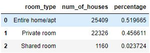
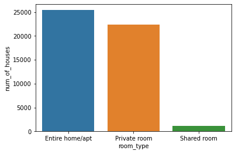
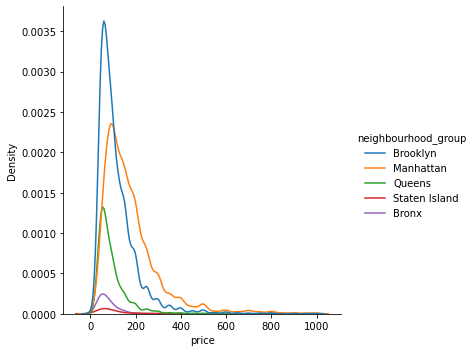
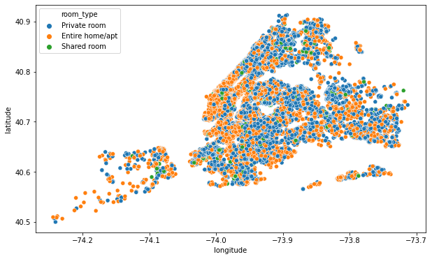
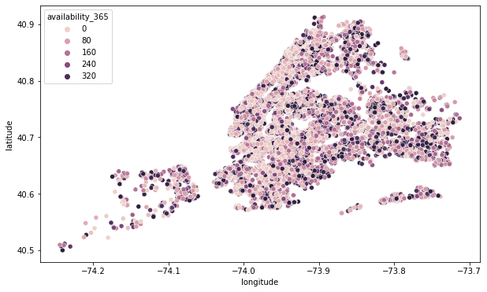
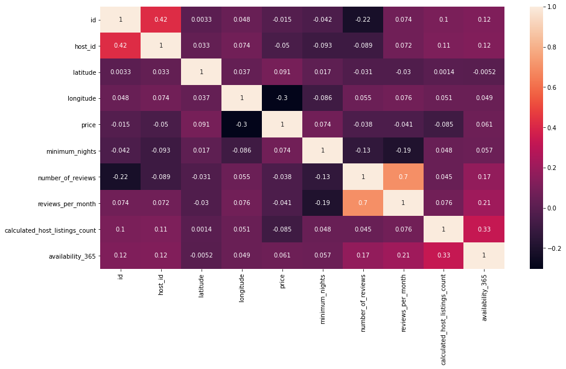
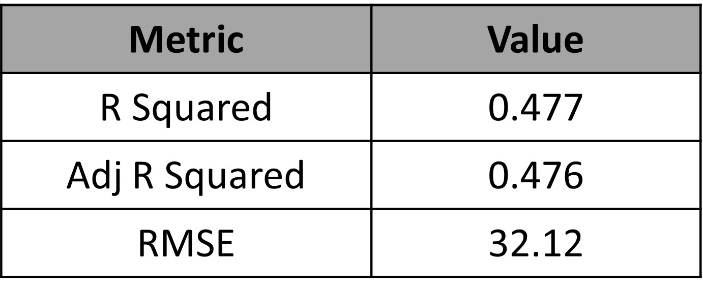
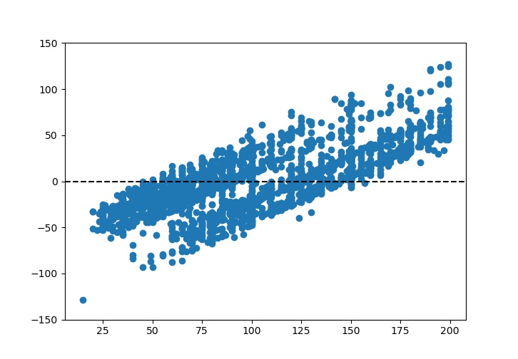
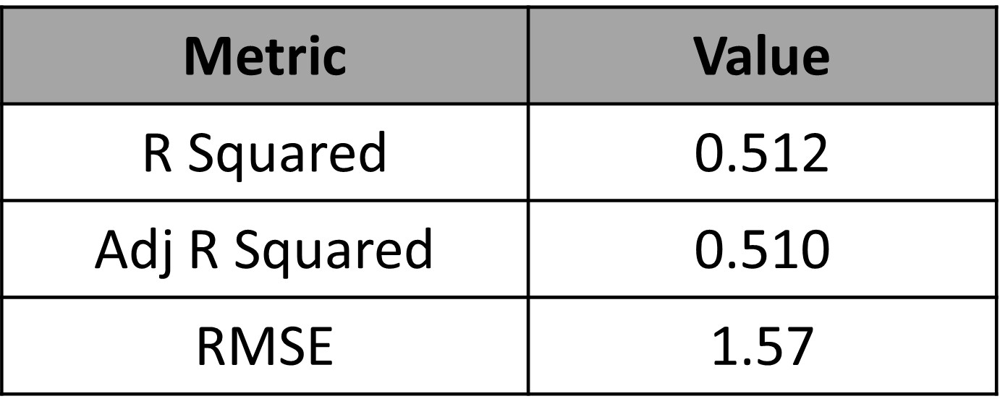
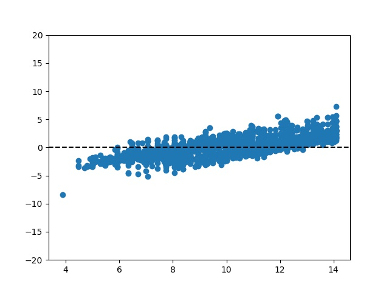

# NYC-AirBNB-Open-Data-Analysis

<b>About Dataset</b>

Context:  
Since 2008, guests and hosts have used Airbnb to expand on traveling possibilities and present more unique, personalized way of experiencing the world. This dataset describes the listing activity and metrics in NYC, NY for 2019.

Content:  
This data file includes all needed information to find out more about hosts, geographical availability, necessary metrics to make predictions and draw conclusions.

Acknowledgements:  
This public dataset is part of Airbnb, and the original source can be found on this website.

Inspiration:  
What can we learn about different hosts and areas?
What can we learn from predictions? (ex: locations, prices, reviews, etc)
Which hosts are the busiest and why?
Is there any noticeable difference of traffic among different areas and what could be the reason for it?

<b>Exploratory Data Analysis</b>

Observations:

- Unique number of neighborhoods : 5
- Unique number of room types : 3
- There are 48895 different airbnbs listed in the dataset.
- There are 37457 different airbnb owners in the dataset.

<b>Airbnb's per user</b>

 

 

Observations:

- ~86% of the owners have only 1 airbnb.
- ~9% of the owners have 2 airbnb's.
- ~2.5% of the owners have 3 airbnb's.

<b>Distribution of Airbnb's based on the neighborhood</b>

 

 

Observations:

- ~44% of the Airbnb's are located in Manhattan.
- ~41% of the Airbnb's are located in Brooklyn.
- ~15% of the Airbnb's are located in Bronx, Queens and Staten Island.

<b>Distribution of Airbnb's based on the type of room</b>

 

 

Observations:

- ~52% of the Airbnb's are are Entire apartment.
- ~45% of the Airbnb's are Private room.
- ~2% of the Airbnb's are shared rooms.

<b>Distribution of Airbnb's based on the price</b>

Observations:

- The mean price of Airbnb's are around $100.
- The price of most of the AirBNB's are concentrated around the $100. 
- A versy small percentage of AirBNB's have higher price than $300.

<b>Distribution of Airbnb's based on the price in different neighborhoods</b>

Observations:

- The mean price of Airbnb's in Manhattan is the highest.

- The mean price of Airbnb's are slightly lower in Brooklyn than Manhattan and the most of them are concentrated around the mean.

<b>Region and Airbnb's</b>

<b>Regionwise Room type</b>

<b>Availability of rooms</b>

<b>Scatterplot of features</b>

Observation:

- There was no significant correlation between any feature in the dataset.

<b>Regression Analysis</b>

To build a regression model for predicting the price of AirBNB, we have filtered only those BNB's which are below $200 dollar each night. The filtering was performed as most of the BNB's are lower than $200 (It can be seen in the PDF above).
 

Before builing the model, irrelavant features were removed such as - 

 - Primary keys (irrelavant) - Id, Host_id

 - Categorical variables (irrelevant) - neighbourhood_group, room_type
   (We have label encoded these groups)

 - Removing one category type from each categories - Staten Island, Shared Room
   (As these are additional group in the predictors)

 

To build the model, stepwise regression modelning was performed.

<b>The first model</b>

Predictors:

- Entire home/apt
- Manhattan
- latitude
- longitude 
- number_of_reviews 
- calculated_host_listings_count

Results:

- price

OLS Summary:

                            OLS Regression Results                            
==============================================================================
Dep. Variable:                  price   R-squared:                       0.477
Model:                            OLS   Adj. R-squared:                  0.476
Method:                 Least Squares   F-statistic:                     454.3
Date:                Mon, 27 Jun 2022   Prob (F-statistic):               0.00
Time:                        22:22:09   Log-Likelihood:                -14665.
No. Observations:                3000   AIC:                         2.934e+04
Df Residuals:                    2993   BIC:                         2.939e+04
Df Model:                           6                                         
Covariance Type:            nonrobust                                         
==================================================================================================
                                     coef    std err          t      P>|t|      [0.025      0.975]
--------------------------------------------------------------------------------------------------
const                          -5833.4460   1499.096     -3.891      0.000   -8772.808   -2894.084
Entire home/apt                   53.5024      1.200     44.586      0.000      51.150      55.855
Manhattan                         20.4296      1.869     10.933      0.000      16.766      24.093
latitude                         -46.8338     14.847     -3.155      0.002     -75.944     -17.723
longitude                       -105.5753     15.209     -6.941      0.000    -135.397     -75.753
number_of_reviews                  0.0469      0.015      3.186      0.001       0.018       0.076
calculated_host_listings_count     0.0502      0.027      1.848      0.065      -0.003       0.103
==============================================================================
Omnibus:                      130.288   Durbin-Watson:                   2.004
Prob(Omnibus):                  0.000   Jarque-Bera (JB):              149.226
Skew:                           0.505   Prob(JB):                     3.95e-33
Kurtosis:                       3.416   Cond. No.                     2.26e+05
==============================================================================

 
Let's visualize the residual plot:

Observation:

- Since we can see the residuals are negative in for the datapoints at the beginning which later become positive, We can see a increasing trend in residual errors.

To reduce the linearity in the residual errors, we can perform transformations in predictors and the results.

<b>The second model</b>

Predictors:

- Entire home/apt
- Manhattan
- latitude
- longitude 
- number_of_reviews 
- calculated_host_listings_count
- square of latitude
- square of longitude
- square of number of reviews
- square of calculated host listings count

Results:

- sqaured root of price

OLS Summary:

                            OLS Regression Results                            
==============================================================================
Dep. Variable:                  price   R-squared:                       0.512
Model:                            OLS   Adj. R-squared:                  0.510
Method:                 Least Squares   F-statistic:                     313.6
Date:                Mon, 27 Jun 2022   Prob (F-statistic):               0.00
Time:                        22:27:22   Log-Likelihood:                -5610.3
No. Observations:                3000   AIC:                         1.124e+04
Df Residuals:                    2989   BIC:                         1.131e+04
Df Model:                          10                                         
Covariance Type:            nonrobust                                         
====================================================================================================
                                       coef    std err          t      P>|t|      [0.025      0.975]
----------------------------------------------------------------------------------------------------
const                            -9.322e+04   3.45e+04     -2.705      0.007   -1.61e+05   -2.57e+04
Entire home/apt                      2.7036      0.059     45.998      0.000       2.588       2.819
longitude                         1415.4808    937.737      1.509      0.131    -423.194    3254.156
latitude                          7135.9938    559.093     12.764      0.000    6039.748    8232.240
Manhattan                            0.9104      0.096      9.457      0.000       0.722       1.099
number_of_reviews                    0.0008      0.002      0.429      0.668      -0.003       0.004
calculated_host_listings_count      -0.0081      0.004     -2.264      0.024      -0.015      -0.001
longitude_2                          9.6156      6.344      1.516      0.130      -2.824      22.055
latitude_2                         -87.6058      6.861    -12.768      0.000    -101.059     -74.152
number_of_reviews_2               1.099e-05   1.02e-05      1.076      0.282   -9.04e-06     3.1e-05
calculated_host_listings_count_2  3.112e-05   1.24e-05      2.516      0.012    6.87e-06    5.54e-05
==============================================================================
Omnibus:                       73.297   Durbin-Watson:                   2.017
Prob(Omnibus):                  0.000   Jarque-Bera (JB):               85.001
Skew:                           0.335   Prob(JB):                     3.49e-19
Kurtosis:                       3.481   Cond. No.                     9.12e+09
==============================================================================

 
Let's visualize the residual plot:

Let's check the condition of equal variance using Levene's test:

<b>statistic=18.386483526081904</b>
<b>pvalue=1.860245656713538e-05</b>

Observation:

- There is still some upward trend remaining in the data but it had been reduced significantly. 
- The constant vaiance condition is not met in this case, so we have to reduce it too.

To reduce the linearity in the residual errors and bringing constant variance in the residual errors, we can perform transformations in predictors and the results. In addition to transformations we have used Weighted least squared Regression this time, to fit the model better.

<b>The third model</b>

Predictors:

- Entire home/apt
- Manhattan
- latitude
- longitude 
- number_of_reviews 
- calculated_host_listings_count
- square of latitude
- square of longitude
- square of number of reviews
- square of calculated host listings count
- cube of longitude
- cube of calculated host listings count
- combined effect of longitude and calculated host listings count
- combined effect of numnber of reviews and calculated host listings count
- combined effect of Manhattan, entire apartment or not and number of reviews
- combined effect of Manhattan, enitre apartment or not and availability of apartment
- combined effect of Manhattan, longitude and latitude
- combined effect of entire apartment, longitude, latitude and Manhattan
- combined effect of squared longitude, squared latitude and number of reviews

Results:

- root under four of price

OLS Summary:

                   WLS Regression Results                            
==============================================================================
Dep. Variable:                  price   R-squared:                       0.645
Model:                            WLS   Adj. R-squared:                  0.643
Method:                 Least Squares   F-statistic:                     284.7
Date:                Mon, 27 Jun 2022   Prob (F-statistic):               0.00
Time:                        22:47:10   Log-Likelihood:                -7739.2
No. Observations:                3000   AIC:                         1.552e+04
Df Residuals:                    2980   BIC:                         1.564e+04
Df Model:                          19                                         
Covariance Type:            nonrobust                                         
====================================================================================================
                                       coef    std err          t      P>|t|      [0.025      0.975]
----------------------------------------------------------------------------------------------------
const                            -9126.3851   1430.266     -6.381      0.000   -1.19e+04   -6321.976
Entire home/apt                      0.4937      0.011     45.199      0.000       0.472       0.515
number_of_reviews                   -1.0537      0.184     -5.726      0.000      -1.415      -0.693
calculated_host_listings_count      -1.0105      1.327     -0.761      0.447      -3.613       1.592
longitude_2                         -2.1726      0.764     -2.844      0.004      -3.671      -0.675
latitude_2                          23.6591      1.271     18.621      0.000      21.168      26.150
number_of_reviews_2               1.236e-05   2.72e-06      4.551      0.000    7.04e-06    1.77e-05
calculated_host_listings_count_2     0.0003    2.3e-05     10.968      0.000       0.000       0.000
longitude_3                         -0.0196      0.007     -2.846      0.004      -0.033      -0.006
latitude_3                          -0.3873      0.021    -18.629      0.000      -0.428      -0.347
calculated_host_listings_count_3 -6.423e-07   6.95e-08     -9.244      0.000   -7.79e-07   -5.06e-07
longitude_chlc                       0.0489      0.015      3.319      0.001       0.020       0.078
latitude_number_of_reviews           0.0454      0.008      5.717      0.000       0.030       0.061
latitude_chls                        0.1133      0.017      6.712      0.000       0.080       0.146
number_of_reviews_chls            3.562e-08   1.26e-08      2.835      0.005     1.1e-08    6.03e-08
manhattan_entire_apt_num_reviews    -0.0022      0.001     -3.214      0.001      -0.003      -0.001
manhattan_entire_apt_available       0.0006   8.02e-05      7.405      0.000       0.000       0.001
manhattan_long_lat                 -8.5e-05   5.13e-06    -16.559      0.000   -9.51e-05   -7.49e-05
entire_home_long_lat_manhattan    5.484e-05   6.46e-06      8.485      0.000    4.22e-05    6.75e-05
long_2_lat_2_number_of_reviews   -8.766e-08   1.71e-08     -5.128      0.000   -1.21e-07   -5.41e-08
==============================================================================
Omnibus:                     1170.517   Durbin-Watson:                   1.884
Prob(Omnibus):                  0.000   Jarque-Bera (JB):           248821.793
Skew:                          -0.667   Prob(JB):                         0.00
Kurtosis:                      47.596   Cond. No.                     1.21e+14
==============================================================================

