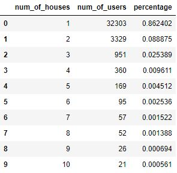
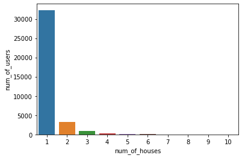
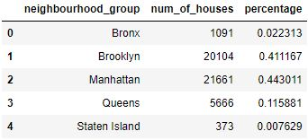
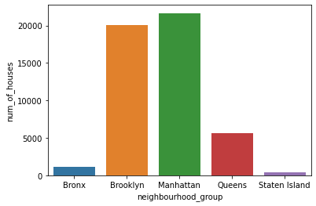
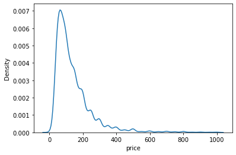

# NYC-AirBNB-Open-Data-Analysis

<b>About Dataset</b>

Context:  
Since 2008, guests and hosts have used Airbnb to expand on traveling possibilities and present more unique, personalized way of experiencing the world. This dataset describes the listing activity and metrics in NYC, NY for 2019.

Content:  
This data file includes all needed information to find out more about hosts, geographical availability, necessary metrics to make predictions and draw conclusions.

Acknowledgements:  
This public dataset is part of Airbnb, and the original source can be found on this website.

Inspiration:  
What can we learn about different hosts and areas?
What can we learn from predictions? (ex: locations, prices, reviews, etc)
Which hosts are the busiest and why?
Is there any noticeable difference of traffic among different areas and what could be the reason for it?

**Exploratory Data Analysis

Observations:

- Unique number of neighborhoods : 5
- Unique number of room types : 3
- There are 48895 different airbnbs listed in the dataset.
- There are 37457 different airbnb owners in the dataset.

**Airbnb's per user

 

 

Observations:

- ~86% of the owners have only 1 airbnb.
- ~9% of the owners have 2 airbnb's.
- ~2.5% of the owners have 3 airbnb's.

**Distribution of Airbnb's based on the neighborhood

 

 

Observations:

- ~44% of the Airbnb's are located in Manhattan.
- ~41% of the Airbnb's are located in Brooklyn.
- ~15% of the Airbnb's are located in Bronx, Queens and Staten Island.

**Distribution of Airbnb's based on the type of room

 

 

Observations:

- ~52% of the Airbnb's are are Entire apartment.
- ~45% of the Airbnb's are Private room.
- ~2% of the Airbnb's are shared rooms.

**Distribution of Airbnb's based on the price

Observations:

- The mean price of Airbnb's are around $100.
- The price of most of the AirBNB's are concentrated around the $100. 
- A versy small percentage of AirBNB's have higher price than $300.

